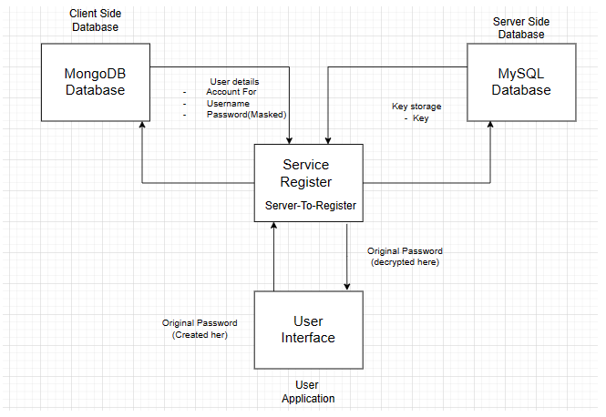

<p align="center">
  
</p>
<p align="center">
    <h1 align="center">LOCKCRYPT</h1>
</p>
<p align="center">
    <em>Password Security Solution`</em>
</p>
<p align="center">
	
	
	
	
<p>
<p align="center">
		<em>Developed with the software and tools below.</em>
</p>
<p align="center">
	
	
	
	
	
	
</p>
<hr>

##  Quick Links

> - [ Overview](#-overview)
> - [ Features](#-features)
> - [Technologies used](#-Technologies-Used)
> - [Architecture](#-Architecture)
> - [ Repository Structure](#-repository-structure)
> - [ Getting Started](#-getting-started)
> - [Project Guide](#-project-guide)
> - [ Installation](#-installation)
> - [ Running LockCrypt](#-running-LockCrypt)
> - [ Contributing](#-contributing)
> - [ License](#-license)
> - [ Acknowledgments](#-acknowledgments)

---

##  Overview
The VaadinFramework project is a web application built using Java, with the frontend developed using the Vaadin framework. It utilizes MySQL and MongoDB databases for storing user data and keys, respectively. The project focuses on password security and employs encryption techniques to ensure sensitive information remains secure.

check out the older version of it at [Password Manager](https://github.com/payallenka/Password-Manager)

---

##  Features

### 1. User Authentication and Data Management:

Users can register and log in to the application.
Once logged in, users can manage their passwords securely.
User details and encrypted passwords are stored in a MongoDB database.


### 2.  Encryption and Decryption:

Original passwords are never stored in the database.
Passwords are encrypted before being stored in the database using encryption keys.
The encryption keys are stored locally on the MySQL database.


### 3. Frontend Development with Vaadin:

The frontend of the application is built using the Vaadin framework, which allows for the creation of modern web applications using Java.
Vaadin simplifies the development process by providing a set of UI components and handling communication between the frontend and backend seamlessly.


### 4. Scalability and Modifiability:

The architecture of the application is designed to be scalable and open for further modifications.
By separating user data storage (MongoDB) from encryption keys storage (MySQL), the application can easily adapt to changes and accommodate additional features in the future.

---

## Technologies Used: 
>- Java: Core programming language used for backend development.  
>- Vaadin Framework: Used for building the frontend of the web application.  
>- MySQL: Relational database management system used for storing encryption keys.   
>- MongoDB: NoSQL database used for storing user details and encrypted passwords.  
>- Encryption Algorithms: Used to encrypt and decrypt passwords securely.  
>- Spring Boot: Provides a robust framework for building and running Java-based applications.  

---

## Architecture:
>- Frontend: Developed using Vaadin framework, allowing for the creation of responsive and interactive user interfaces.  
>- Backend: Built using Java with Spring Boot, providing a scalable and maintainable backend infrastructure.  
>- Database Layer: Utilizes MySQL for storing encryption keys and MongoDB for storing user details and encrypted passwords.    
>- Security: Implements encryption techniques to ensure the security of user passwords and sensitive information.  

---

##  Repository Structure

```sh
└── LockCrypt/
    ├── MongoDBDatabase
    │   ├── .idea
    │   │   ├── .gitignore
    │   │   ├── MongoDBDatabase.iml
    │   │   ├── compiler.xml
    │   │   ├── encodings.xml
    │   │   ├── jarRepositories.xml
    │   │   ├── misc.xml
    │   │   ├── modules.xml
    │   │   └── uiDesigner.xml
    │   └── MongoDBDatabase
    │       ├── .gitignore
    │       ├── .mvn
    │       │   └── wrapper
    │       │       ├── maven-wrapper.jar
    │       │       └── maven-wrapper.properties
    │       ├── mvnw
    │       ├── mvnw.cmd
    │       ├── pom.xml
    │       └── src
    │           ├── main
    │           │   ├── java
    │           │   └── resources
    │           └── test
    │               └── java
    ├── MySQLHandle
    │   ├── .idea
    │   │   ├── .gitignore
    │   │   ├── MySQLHandle.iml
    │   │   ├── compiler.xml
    │   │   ├── encodings.xml
    │   │   ├── jarRepositories.xml
    │   │   ├── misc.xml
    │   │   └── modules.xml
    │   └── MySQLHandle
    │       ├── .gitignore
    │       ├── .mvn
    │       │   └── wrapper
    │       │       ├── maven-wrapper.jar
    │       │       └── maven-wrapper.properties
    │       ├── frontend
    │       │   ├── generated
    │       │   │   ├── flow
    │       │   │   ├── jar-resources
    │       │   │   ├── vaadin-featureflags.js
    │       │   │   └── vaadin.ts
    │       │   └── index.html
    │       ├── mvnw
    │       ├── mvnw.cmd
    │       ├── pom.xml
    │       └── src
    │           ├── main
    │           │   ├── java
    │           │   └── resources
    │           └── test
    │               └── java
    ├── README.md
    ├── VaadinFramework
    │   ├── .idea
    │   │   ├── .gitignore
    │   │   ├── VaadinFramework.iml
    │   │   ├── compiler.xml
    │   │   ├── encodings.xml
    │   │   ├── jarRepositories.xml
    │   │   ├── misc.xml
    │   │   └── modules.xml
    │   └── VaadinFramework
    │       ├── .gitignore
    │       ├── .mvn
    │       │   └── wrapper
    │       │       ├── maven-wrapper.jar
    │       │       └── maven-wrapper.properties
    │       ├── frontend
    │       │   ├── generated
    │       │   │   ├── flow
    │       │   │   ├── jar-resources
    │       │   │   ├── vaadin-featureflags.js
    │       │   │   └── vaadin.ts
    │       │   └── index.html
    │       ├── mvnw
    │       ├── mvnw.cmd
    │       ├── pom.xml
    │       └── src
    │           ├── main
    │           │   ├── java
    │           │   └── resources
    │           └── test
    │               └── java
    └── serviceRegister
        └── serviceRegister
            ├── .gitignore
            ├── .mvn
            │   └── wrapper
            │       ├── maven-wrapper.jar
            │       └── maven-wrapper.properties
            ├── mvnw
            ├── mvnw.cmd
            ├── pom.xml
            └── src
                ├── main
                │   ├── java
                │   └── resources
                └── test
                    └── java
```

---


## Architecture
<p align="center">
  
</p>

<p align="center">
    <h1 align="center">Microservices Diagram</h1>
</p>
##  Getting Started

***Requirements***

Ensure you have the following dependencies installed on your system:

* **Intellij IDEA**: `version 2023.1.6`
* **MySQL**: `version latest version` - set the username as roo (default) and password as root@123 ensure to create a database names monolithmodelpasswordmanager (recommended)

###  Installation

1. Clone the LockCrypt repository:

```sh
git clone https://github.com/payallenka/LockCrypt
```

2. Change to the project directory:

```sh
cd LockCrypt
```

3. open all the individual folders as a seperate intellijIDEA project


###  Running LockCrypt

run the server 

```sh
npm run build && node dist/main.js
```

###  Tests

To execute tests, run: (optional - most of the microservices are self-sufficient)

```sh
npm test   
```
## Project guide
> -  Install Intellij IDEA (specified version recommended).
> -  Clone the repository.
> -  Run the SpringBoot application of the 'serviceRegister' (It will start the Eureka Server).
> -  Run the SpringBoot application of the all the other microservices. (In seperate windows)
> -  Caution: Do not shut /close/stop the 'serviceRegister' as it is the Eureka Server.
> -  On successfull run navigate to localhost:7000 (cross check the logs for the correct port number).
> -  Enjoy the flow 💯


### Any persistent Issue feel free to reach out - would love to resolve the issue
---

##  Contributing

Contributions are welcome! Here are several ways you can contribute:

- **[Submit Pull Requests](https://github.com/payallenka/LockCrypt/blob/main/CONTRIBUTING.md)**: Review open PRs, and submit your own PRs.
- **[Join the Discussions](https://github.com/payallenka/LockCrypt/discussions)**: Share your insights, provide feedback, or ask questions.
- **[Report Issues](https://github.com/payallenka/LockCrypt/issues)**: Submit bugs found or log feature requests for Lockcrypt.

<details closed>
    <summary>Contributing Guidelines</summary>

1. **Fork the Repository**: Start by forking the project repository to your GitHub account.
2. **Clone Locally**: Clone the forked repository to your local machine using a Git client.
   ```sh
   git clone https://github.com/payallenka/LockCrypt
   ```
3. **Create a New Branch**: Always work on a new branch, giving it a descriptive name.
   ```sh
   git checkout -b new-feature-x
   ```
4. **Make Your Changes**: Develop and test your changes locally.
5. **Commit Your Changes**: Commit with a clear message describing your updates.
   ```sh
   git commit -m 'Implemented new feature x.'
   ```
6. **Push to GitHub**: Push the changes to your forked repository.
   ```sh
   git push origin new-feature-x
   ```
7. **Submit a Pull Request**: Create a PR against the original project repository. Clearly describe the changes and their motivations.

Once your PR is reviewed and approved, it will be merged into the main branch.

</details>

---

##  License

This project is protected under the [SELECT-A-LICENSE](https://choosealicense.com/licenses) License. For more details, refer to the [LICENSE](https://choosealicense.com/licenses/) file.

---

##  Acknowledgments

- Prof. Devraju Sir (guide)
- Prof. Laxmi ma'am (cryptography algorithms expert)

---
