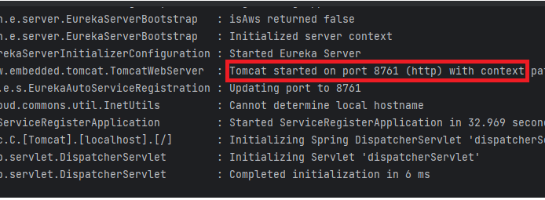
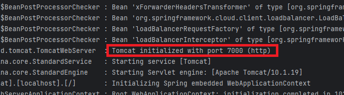
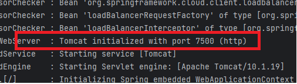
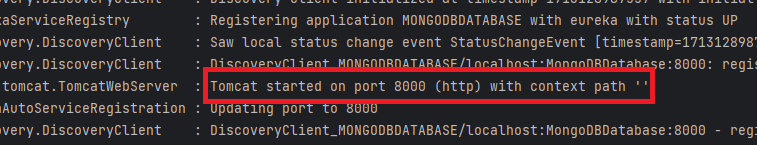
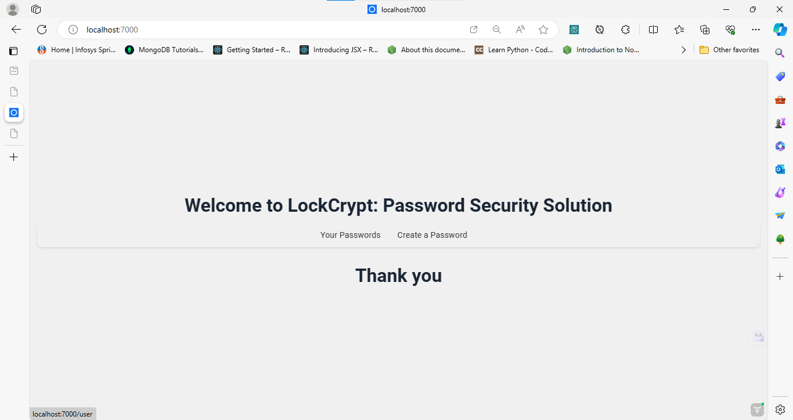
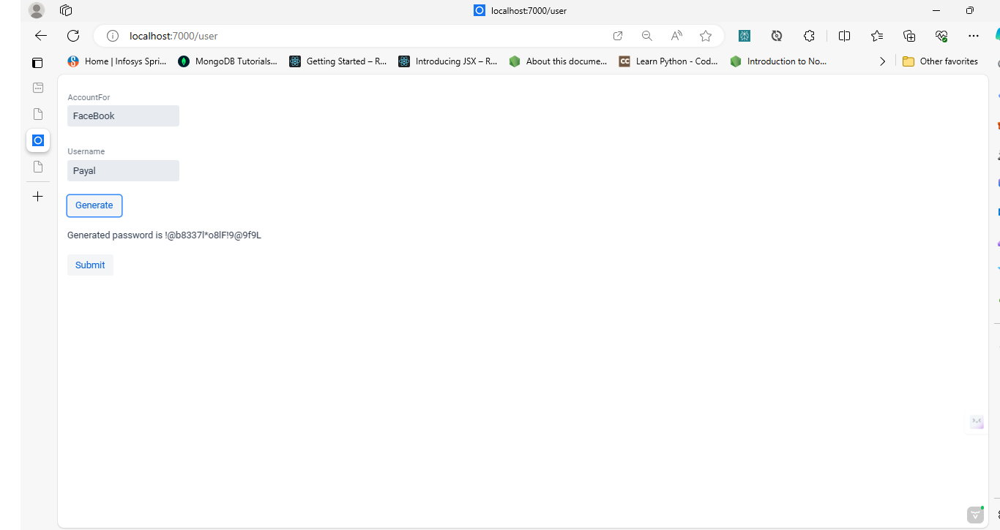
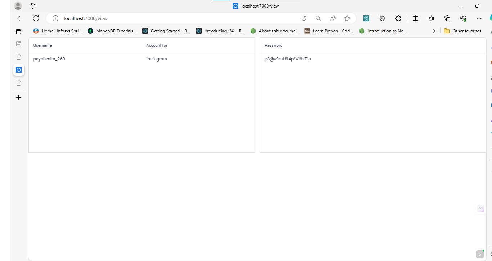

<p align="center">
  
</p>
<p align="center">
    <h1 align="center">LOCKCRYPT</h1>
</p>
<p align="center">
    <em>Password Security Solution`</em>
</p>
<p align="center">
	
	
	
	
<p>
<p align="center">
		<em>Developed with the software and tools below.</em>
</p>
<p align="center">
	
	
	
	
	
	
</p>
<hr>


##  Overview
The VaadinFramework project is a web application built using Java, with the frontend developed using the Vaadin framework. It utilizes MySQL and MongoDB databases for storing user data and keys, respectively. The project focuses on password security and employs encryption techniques to ensure sensitive information remains secure.

check out the older version of it at [Password Manager](https://github.com/payallenka/Password-Manager)

---

##  Features

### 1. User Authentication and Data Management:

Users can register and log in to the application.
Once logged in, users can manage their passwords securely.
User details and encrypted passwords are stored in a MongoDB database.


### 2.  Encryption and Decryption:

Original passwords are never stored in the database.
Passwords are encrypted before being stored in the database using encryption keys.
The encryption keys are stored locally on the MySQL database.


### 3. Frontend Development with Vaadin:

The frontend of the application is built using the Vaadin framework, which allows for the creation of modern web applications using Java.
Vaadin simplifies the development process by providing a set of UI components and handling communication between the frontend and backend seamlessly.


### 4. Scalability and Modifiability:

The architecture of the application is designed to be scalable and open for further modifications.
By separating user data storage (MongoDB) from encryption keys storage (MySQL), the application can easily adapt to changes and accommodate additional features in the future.

---

## Technologies Used: 
>- Java: Core programming language used for backend development.  
>- Vaadin Framework: Used for building the frontend of the web application.  
>- MySQL: Relational database management system used for storing encryption keys.   
>- MongoDB: NoSQL database used for storing user details and encrypted passwords.  
>- Encryption Algorithms: Used to encrypt and decrypt passwords securely.  
>- Spring Boot: Provides a robust framework for building and running Java-based applications.  

---

## Architecture:
>- Frontend: Developed using Vaadin framework, allowing for the creation of responsive and interactive user interfaces.  
>- Backend: Built using Java with Spring Boot, providing a scalable and maintainable backend infrastructure.  
>- Database Layer: Utilizes MySQL for storing encryption keys and MongoDB for storing user details and encrypted passwords.    
>- Security: Implements encryption techniques to ensure the security of user passwords and sensitive information.  

---

##  Repository Structure

```sh
└── LockCrypt/
    ├── MongoDBDatabase
    │   ├── .idea
    │   │   ├── .gitignore
    │   │   ├── MongoDBDatabase.iml
    │   │   ├── compiler.xml
    │   │   ├── encodings.xml
    │   │   ├── jarRepositories.xml
    │   │   ├── misc.xml
    │   │   ├── modules.xml
    │   │   └── uiDesigner.xml
    │   └── MongoDBDatabase
    │       ├── .gitignore
    │       ├── .mvn
    │       │   └── wrapper
    │       │       ├── maven-wrapper.jar
    │       │       └── maven-wrapper.properties
    │       ├── mvnw
    │       ├── mvnw.cmd
    │       ├── pom.xml
    │       └── src
    │           ├── main
    │           │   ├── java
    │           │   └── resources
    │           └── test
    │               └── java
    ├── MySQLHandle
    │   ├── .idea
    │   │   ├── .gitignore
    │   │   ├── MySQLHandle.iml
    │   │   ├── compiler.xml
    │   │   ├── encodings.xml
    │   │   ├── jarRepositories.xml
    │   │   ├── misc.xml
    │   │   └── modules.xml
    │   └── MySQLHandle
    │       ├── .gitignore
    │       ├── .mvn
    │       │   └── wrapper
    │       │       ├── maven-wrapper.jar
    │       │       └── maven-wrapper.properties
    │       ├── frontend
    │       │   ├── generated
    │       │   │   ├── flow
    │       │   │   ├── jar-resources
    │       │   │   ├── vaadin-featureflags.js
    │       │   │   └── vaadin.ts
    │       │   └── index.html
    │       ├── mvnw
    │       ├── mvnw.cmd
    │       ├── pom.xml
    │       └── src
    │           ├── main
    │           │   ├── java
    │           │   └── resources
    │           └── test
    │               └── java
    ├── README.md
    ├── VaadinFramework
    │   ├── .idea
    │   │   ├── .gitignore
    │   │   ├── VaadinFramework.iml
    │   │   ├── compiler.xml
    │   │   ├── encodings.xml
    │   │   ├── jarRepositories.xml
    │   │   ├── misc.xml
    │   │   └── modules.xml
    │   └── VaadinFramework
    │       ├── .gitignore
    │       ├── .mvn
    │       │   └── wrapper
    │       │       ├── maven-wrapper.jar
    │       │       └── maven-wrapper.properties
    │       ├── frontend
    │       │   ├── generated
    │       │   │   ├── flow
    │       │   │   ├── jar-resources
    │       │   │   ├── vaadin-featureflags.js
    │       │   │   └── vaadin.ts
    │       │   └── index.html
    │       ├── mvnw
    │       ├── mvnw.cmd
    │       ├── pom.xml
    │       └── src
    │           ├── main
    │           │   ├── java
    │           │   └── resources
    │           └── test
    │               └── java
    └── serviceRegister
        └── serviceRegister
            ├── .gitignore
            ├── .mvn
            │   └── wrapper
            │       ├── maven-wrapper.jar
            │       └── maven-wrapper.properties
            ├── mvnw
            ├── mvnw.cmd
            ├── pom.xml
            └── src
                ├── main
                │   ├── java
                │   └── resources
                └── test
                    └── java
```

---


## Architecture
<p align="center">
  
</p>

<p align="center">
    <h1 align="center">Microservices Diagram</h1>
</p>
##  Getting Started

***Requirements***

Ensure you have the following dependencies installed on your system:

* **Intellij IDEA**: `version 2023.1.6`
* **MySQL**: `version latest version` - set the username as roo (default) and password as root@123 ensure to create a database names monolithmodelpasswordmanager (recommended)

###  Installation

1. Clone the LockCrypt repository:

```sh
git clone https://github.com/payallenka/LockCrypt
```

2. Change to the project directory:

```sh
cd LockCrypt
```

3. open all the individual folders as a seperate intellijIDEA project

## Project Guide

### Installing Intellij IDEA
- Install Intellij IDEA, with the specified version recommended for this project.

### Cloning the Repository
- Clone the repository to your local machine.

### Setting Up MongoDB Atlas with MongoDB Compass

To connect to MongoDB Atlas using MongoDB Compass, follow these steps:

1. **Open MongoDB Atlas Dashboard:** Go to the MongoDB Atlas website [here](https://www.mongodb.com/cloud/atlas) and log in to your account.

2. **Select Your Cluster:** From the Atlas dashboard, select the cluster you want to connect to. If you haven't created a cluster yet, follow the instructions to create one.

3. **Click on "Connect":** In the cluster view, click on the "Connect" button.

4. **Choose Connection Method:** Select "Connect with MongoDB Compass" option.

5. **Copy Connection String:** MongoDB Atlas will provide you with a connection string. Click on the "Copy" button next to the connection string to copy it to your clipboard.

6. **Open MongoDB Compass:** If you haven't installed MongoDB Compass yet, download and install it from the official MongoDB website [here](https://www.mongodb.com/try/download/compass).

7. **Launch MongoDB Compass:** Open MongoDB Compass after installation.

8. **Connect to Cluster:** In MongoDB Compass, click on the "Connect" button to open the connection dialog.

9. **Paste Connection String:** In the connection dialog, paste the connection string you copied from MongoDB Atlas. If prompted, enter your MongoDB Atlas username and password.

10. **Configure Connection Options (Optional):** You can configure additional connection options such as SSH tunneling, SSL, etc., as per your requirements.

11. **Test Connection:** Click on the "Connect" button to test the connection to the MongoDB Atlas cluster.

12. **Verify Connection:** Once connected, MongoDB Compass will display a list of databases and collections available in your MongoDB Atlas cluster.

13. **Perform Operations:** You can now perform various database operations such as querying data, inserting documents, managing indexes, etc., using MongoDB Compass.

14. **Disconnect:** When you're done working with the cluster, you can disconnect from MongoDB Atlas by closing MongoDB Compass or clicking on the "Disconnect" button in MongoDB Compass.

### Setting Up MySQL Database

To set up MySQL on your local system and create a database to match the given JDBC URL, follow these steps:

1. **Install MySQL Server:** Download and install MySQL Server from the official MySQL website. SET THE PASSWORD AS 'root@123' otherwise kinldy edit the application.properties of the VaadinFramework and the MySQLHandle with your defined password.

2. **Start MySQL Server:** Start the MySQL Server service on your local system. 

3. **Access MySQL Shell:** Access the MySQL shell using the MySQL command-line client or any MySQL GUI tool.

4. **Create Database:** Create a new database named `MonolithModelPasswordManager` using the following SQL command:
   ```sql
   CREATE DATABASE MonolithModelPasswordManager;
5. **Creating a Table in MySQL** 

Create a table in MySQL with an auto-increment primary key and the provided fields, you can use the following SQL command:

```sql
CREATE TABLE password (
    id INT AUTO_INCREMENT PRIMARY KEY,
    password_key VARCHAR(255)
);

```


### Running Microservices
- Run the SpringBoot application of the 'serviceRegister' (It will start the Eureka Server).
On sucessful run you'll see something like in the image below.
<p align="center">
  
</p>
<p align="center">
    <h1 align="center">Server Successfully built! </h1>
</p>
- Run the SpringBoot application of all the other microservices in separate windows of IntellijIDEA.
On sucessful run you'll see something like in the image below.
<p align="center">
  
<p align="center">
    <h1 align="center">FrontEnd - Vaadin Successful buid</h1>
</p>
  
  <p align="center">
    <h1 align="center">MySQL service Successful buid</h1>
</p>
  
</p>

<p align="center">
    <h1 align="center">MongoDB service Successful buid</h1>
</p>
- Caution: Do not shut/close/stop the 'serviceRegister' as it is the Eureka Server and all the microservices will register there.
- On successful run navigate to localhost:7000 (cross check the logs for the correct port number).
On sucessful run you'll see something like in the image below.
</p>
  
</p>
<p align="center">
    <h1 align="center">Landing page</h1>
</p>

</p>
  
</p>
<p align="center">
    <h1 align="center">Password Creation page</h1>
</p>
</p>
  
</p>
<p align="center">
    <h1 align="center">Password View page</h1>
</p>
- Enjoy the flow! 💯


### Any persistent Issue feel free to reach out - would love to resolve the issue
---

##  Contributing

Contributions are welcome! Here are several ways you can contribute:

- **[Submit Pull Requests](https://github.com/payallenka/LockCrypt/blob/main/CONTRIBUTING.md)**: Review open PRs, and submit your own PRs.
- **[Join the Discussions](https://github.com/payallenka/LockCrypt/discussions)**: Share your insights, provide feedback, or ask questions.
- **[Report Issues](https://github.com/payallenka/LockCrypt/issues)**: Submit bugs found or log feature requests for Lockcrypt.


1. **Fork the Repository**: Start by forking the project repository to your GitHub account.
2. **Clone Locally**: Clone the forked repository to your local machine using a Git client.
   ```sh
   git clone https://github.com/payallenka/LockCrypt
   ```
3. **Create a New Branch**: Always work on a new branch, giving it a descriptive name.
   ```sh
   git checkout -b new-feature-x
   ```
4. **Make Your Changes**: Develop and test your changes locally.
5. **Commit Your Changes**: Commit with a clear message describing your updates.
   ```sh
   git commit -m 'Implemented new feature x.'
   ```
6. **Push to GitHub**: Push the changes to your forked repository.
   ```sh
   git push origin new-feature-x
   ```
7. **Submit a Pull Request**: Create a PR against the original project repository. Clearly describe the changes and their motivations.

Once your PR is reviewed and approved, it will be merged into the main branch.

</details>

---

##  License

This project is protected under the [SELECT-A-LICENSE](https://choosealicense.com/licenses) License. For more details, refer to the [LICENSE](https://choosealicense.com/licenses/) file.

---

##  Acknowledgments

- Prof. Devraju Sir (guide)
- Prof. Laxmi ma'am (cryptography algorithms expert)

---
